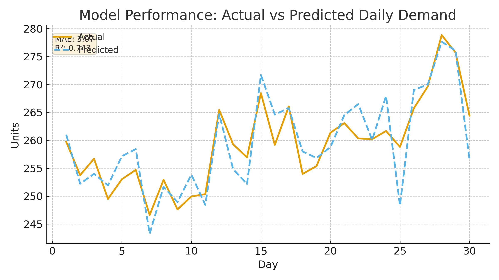
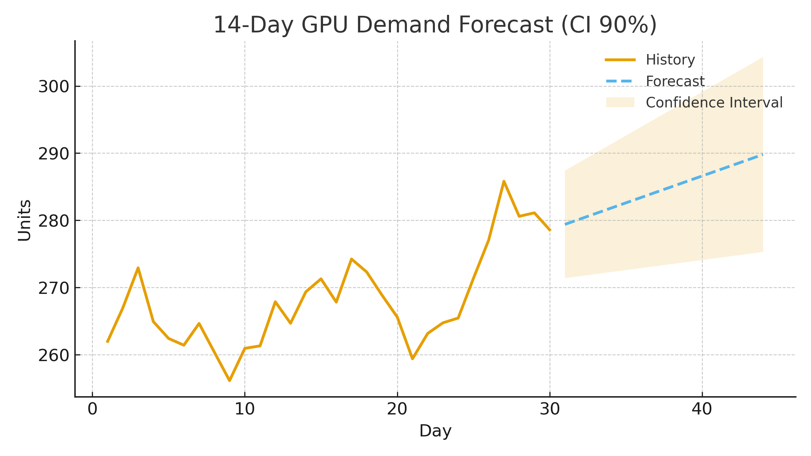
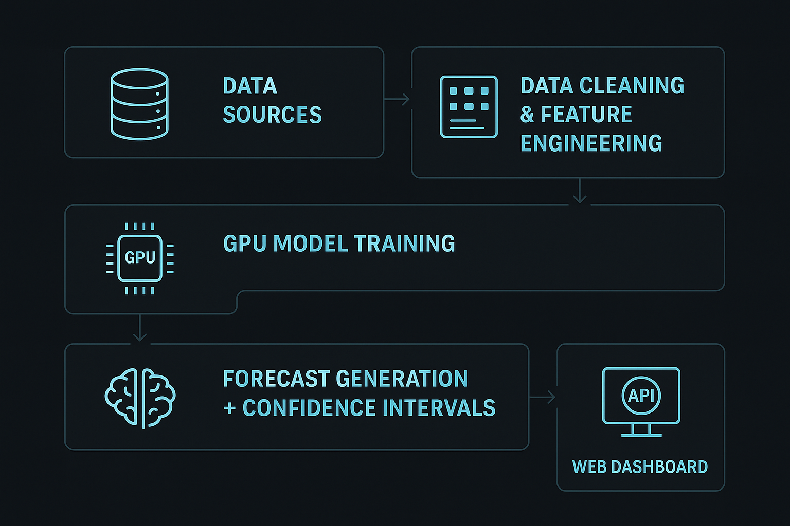

<!-- BANNER -->
<!-- 

  

 -->

<!-- HEADER -->

<h1 align="center">Hey! I'm Damian</h1> 
<h3 align="center">Junior Data Scientist • Python • Machine Learning • Forecasting</h3>

  
  
  

---

## 🧭 About me
I’m a **Junior Data Scientist** with a strong foundation in business intelligence and a growing focus on machine learning for real-world forecasting and decision systems.
My work sits at the intersection of retail operations and applied AI — using data to improve planning, efficiency, and business impact.
     
🏢 Currently: Junior Data Scientist @ Rossmann Polska  
⚙️ Building: GPU-accelerated forecasting platform (XGBoost / RAPIDS / FastAPI)  
💡 Focus: demand prediction, anomaly detection, model optimization  
🧠 Philosophy: “Less noise, more signal — data science that drives decisions.”  

---
<!--  -->

## ⚙️ Tech Stack

  

💡 **Core:** Python · Pandas · NumPy · scikit-learn · SQL · Qlik Sense  
📚 **Currently Learning:** XGBoost · Time Series Forecasting · FastAPI · Streamlit · GitHub Actions  
🚀 **Exploring Next:** RAPIDS (GPU Computing) · Optuna · Docker

---

## 🚀 Featured Projects

**GPU Forecast Platform (MVP)** — GPU-accelerated demand forecasting engine (XGBoost / RAPIDS).  
→ Benchmarks CPU vs GPU performance, deploys forecasts via FastAPI.  
🔗 [Repo](#) · [Demo](#)

**Retail EDA Toolkit** — plug-and-play EDA framework for retail datasets.  
→ Simplifies feature discovery, trend analysis, and KPI visualization.  
🔗 [Repo](#)

**FPL333 Analytics** — real-time Fantasy Premier League dashboard.  
→ Tracks scores, transfers, and standings with automated updates.  
🔗 [Repo](https://github.com/acroice/fpl333) · [Live](https://fpl333.vercel.app/)

---

📊 Visuals

I love exploring and visualizing data — from raw EDA to model explainability and forecasts.  
Here are some selected visuals from my recent projects.
  
### 🧠 EDA & Insights

### ⚙️ Model Evaluation

### 🔮 Forecasting

### 🧱 System Design

---
## 📚 Currently Learning
> balancing theory + small applied projects  
- 🧮 *Feature engineering for time series* (lags, rolling windows, calendar features)  
- 🔧 *Model deployment basics* – Streamlit & FastAPI  
- 🧰 *Workflow automation* – CI/CD for small ML repos  
- 📈 *Explaining models* – SHAP, feature importance, partial dependence  

---

## 💬 Let's Connect

  
  
  

---

## 📈 GitHub Stats

  
  

  

