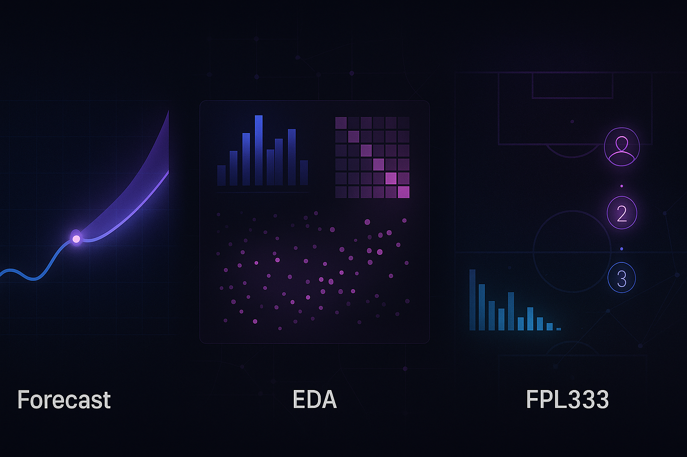

<!-- BANNER -->

  

<!-- HEADER -->
<h1 align="center">👋 Hey, I'm Damian</h1>
<h3 align="center">Junior Data Scientist • Python • Machine Learning • Forecasting</h3>

  
  
  

---

## 🧭 About me
I’m a **Junior Data Scientist** combining 3 years of **BI & analytics** experience with a growing focus on **machine learning and forecasting**.  
My goal is to bridge the gap between business and data — turning messy datasets into real, explainable insights.

- 🏢 **Currently:** Data Scientist @ Rossmann Polska  
- 🔭 **Building:** GPU-accelerated demand forecasting platform (XGBoost / RAPIDS)  
- 💡 **Interests:** forecasting, anomaly detection, retail analytics  
- 🧩 **Mindset:** “Less fluff, more data — small projects that actually work.”

---

## ⚙️ Tech Stack

  

**Core:** Python · Pandas · NumPy · scikit-learn · SQL · Qlik Sense  
**Learning:** XGBoost · Time Series · FastAPI · Streamlit · GitHub Actions  
**Experimenting:** RAPIDS · cuDF · Optuna · Docker

---

## 🚀 Featured Projects
| 🧠 Project | 🔍 Description | 🧰 Stack | 🔗 Links |
|------------|----------------|----------|-----------|
| **GPU Forecast Platform (MVP)** | Benchmarking CPU vs GPU performance for sales forecasting (M5 dataset). | Python, Pandas, XGBoost, RAPIDS | [Repo](#) · [Demo](#) |
| **Retail EDA Starter** | Quick-start EDA and reporting template for retail/warehouse data. | Python, Pandas, Matplotlib | [Repo](#) |
| **FPL333 Analytics** | Custom Fantasy Premier League analytics dashboard (private league). | Python, Streamlit, Requests | [Repo](#) · [Live](#) |

---

## 📊 Visuals

  

---

## 📚 Currently Learning
> balancing theory + small applied projects  
- 🧮 *Feature engineering for time series* (lags, rolling windows, calendar features)  
- 🔧 *Model deployment basics* – Streamlit & FastAPI  
- 🧰 *Workflow automation* – CI/CD for small ML repos  
- 📈 *Explaining models* – SHAP, feature importance, partial dependence  

---

## 💬 Let's Connect

  
  
  

---

## 📈 GitHub Stats

  
  

  

